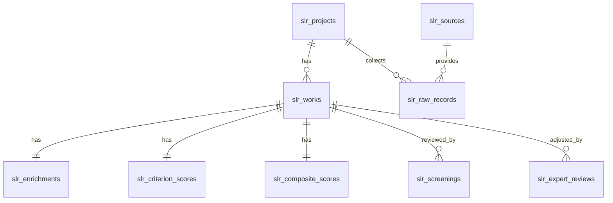

# SLR Ranking (Laravel Package)

[](https://packagist.org/packages/mbsoft31/slr-ranking)
[](https://github.com/mbsoft31/slr-ranking/actions?query=workflow%3Arun-tests+branch%3Amain)
[](https://github.com/mbsoft31/slr-ranking/actions?query=workflow%3A"Fix+PHP+code+style+issues"+branch%3Amain)
[](https://packagist.org/packages/mbsoft31/slr-ranking)


> **Headless, auditable SLR pipeline** for open-source evidence ranking — protocol → connectors (OpenAlex/Crossref/arXiv/Semantic Scholar) → normalization & dedup → enrichment (OA/code/data/citations) → **scoring** (venue, recency, OA/repro, novelty, realism, breadth) → **exports**.
> Built as a **Laravel package** (no UI), following **Spatie Package Tools** conventions.

---

## Table of Contents

* [Features](#features)
* [Requirements](#requirements)
* [Installation](#installation)
* [Configuration](#configuration)
* [Environment Variables](#environment-variables)
* [Data Model](#data-model)
* [Connectors](#connectors)
* [Normalization & Dedup](#normalization--dedup)
* [Enrichment](#enrichment)
* [Scoring](#scoring)
* [CLI Commands](#cli-commands)
* [Quickstart](#quickstart)
* [Scheduling (optional)](#scheduling-optional)
* [Search Integration (optional)](#search-integration-optional)
* [Testing](#testing)
* [FAQ](#faq)
* [Roadmap](#roadmap)
* [Contributing](#contributing)
* [Security & ToS](#security--tos)
* [License](#license)

---

## Features

* **Package-only (no UI):** pure Eloquent models, services, jobs, and CLI commands.
* **Protocol storage:** projects keep objective, weights, half-life, search strings, and eligibility rules.
* **Open connectors:** **OpenAlex**, **Crossref**, **arXiv**, **Semantic Scholar (S2)** with cursor/offset paging.
* **Normalization & dedup:** unified “work” per paper (DOI favored; fuzzy title match fallback).
* **Enrichment:** Unpaywall (OA), code/data link detection, citation counts & fields.
* **Scoring engine:** venue quality, recency (half-life), OA & reproducibility, novelty, realism, breadth → **composite 0–100**.
* **Exports:** JSON project bundle (CSV/Markdown planned).
* **Lookups:** SJR quartiles & CORE ranks via CSV uploads (versioned snapshots).
* **Auditable:** minimal audit log events & immutable derived scores.

---

## Requirements

* **PHP**: 8.2+
* **Laravel**: 10.x or 11.x
* **Database**: any supported by Laravel (PostgreSQL recommended)
* **Queues**: Redis (recommended) or any Laravel queue backend
* **HTTP**: Guzzle (already required)
* Optional:

    * **Laravel Scout** + **Meilisearch** for full-text indexing
    * **Laravel Horizon** for queue monitoring

---

## Installation

### 1) Require the package

**Monorepo / local path:**

```jsonc
// composer.json (of your host app)
{
  "repositories": [
    { "type": "path", "url": "packages/mbsoft/slr-ranking" }
  ]
}
```

```bash
composer require mbsoft/slr-ranking:dev-main
```

**Standalone (from VCS):**

```bash
composer require mbsoft/slr-ranking
```

### 2) Publish config & migrations

```bash
php artisan slr:install
php artisan migrate
```

### 3) Set environment

Add at least:

```env
UNPAYWALL_EMAIL=you@example.com
OPENALEX_BASE=https://api.openalex.org
CROSSREF_BASE=https://api.crossref.org
S2_BASE=https://api.semanticscholar.org/graph/v1
ARXIV_BASE=https://export.arxiv.org/api
```

### 4) Run queues

```bash
php artisan queue:work
# (or) php artisan horizon
```

---

## Configuration

`config/slr-ranking.php` (published by `slr:install`):

```php
return [
    'half_life' => 3.0,  // years for recency decay
    'default_weights' => [
        'venue' => 0.30, 'recency' => 0.15, 'oa' => 0.05,
        'novelty' => 0.20, 'realism' => 0.20, 'breadth' => 0.10,
    ],
    'user_model' => \App\Models\User::class,

    'endpoints' => [
        'openalex' => env('OPENALEX_BASE', 'https://api.openalex.org'),
        'crossref' => env('CROSSREF_BASE', 'https://api.crossref.org'),
        'unpaywall'=> 'https://api.unpaywall.org/v2',
        's2'       => env('S2_BASE', 'https://api.semanticscholar.org/graph/v1'),
        'arxiv'    => env('ARXIV_BASE', 'https://export.arxiv.org/api'),
    ],
    'unpaywall_email' => env('UNPAYWALL_EMAIL'),

    // Optional search: set to 'scout' to enable Laravel Scout indexing
    'search_driver' => env('SLR_SEARCH', null),

    'features' => [
        // If true, venue quality falls back to a capped percentile of citations when SJR/CORE missing.
        'citations_percentile_fallback' => true,
    ],
];
```

---

## Environment Variables

* `UNPAYWALL_EMAIL` — required by Unpaywall.
* `OPENALEX_BASE`, `CROSSREF_BASE`, `S2_BASE`, `ARXIV_BASE` — override endpoints if needed.
* `SLR_SEARCH=scout` — enable Scout indexing (host app must configure Scout + Meilisearch).
* Usual Laravel queue/database configuration as per your app.

---

## Data Model

Tables (all prefixed `slr_`):

* **projects** — protocol store: name, objective, weights, search strings, inclusion rules, half-life.
* **sources** — connector catalog (openalex, crossref, arxiv, semanticscholar, manual).
* **raw\_records** — raw JSON per source pull (for audit/replay).
* **works** — **normalized** unique works (per project).
* **enrichments** — OA flags, OA URL, code/data links, citations, fields.
* **venue\_metrics** — versioned SJR/CORE snapshots.
* **screenings** — TA/FT screening decisions (reviewer morphs).
* **criterion\_scores** — per-criterion scores.
* **composite\_scores** — final composite (breakdown + timestamp).
* **expert\_reviews** — expert notes, adjustment deltas, overrides.
* **audit\_logs** — lightweight action trail.
* **lookups\_sjr**, **lookups\_core** — uploaded CSV snapshots.

### ER (Mermaid)



---

## Connectors

Each connector is queued and writes **raw\_records** → normalization job → enrichment → scoring.

* **OpenAlex**: `/works` endpoint with cursor paging.
* **Crossref**: `/works` with query + filter (e.g., `type:journal-article`).
* **arXiv**: Atom feed (XML) paginated with `start`/`max_results`.
* **Semantic Scholar (S2)**: `/paper/search` offset/limit; optional DOI lookups for enrichment fallback.

**Project `search_strings` structure** (JSON):

```json
{
  "openalex": { "q": "vision transformer agriculture", "filter": "from_publication_date:2023-01-01" },
  "crossref": { "q": "agriculture transformer", "filter": "type:journal-article,from-pub-date:2023-01-01" },
  "arxiv":    { "q": "ti:(agriculture) AND (cat:cs.CV OR cs.LG)" },
  "s2":       { "q": "agriculture transformer" }
}
```

> **Rate limits & ToS:** Be polite; the package does not bypass rate limits. You are responsible for adhering to each source’s ToS.

---

## Normalization & Dedup

* **Precedence:** DOI > OpenAlex > Crossref > arXiv > S2 (field-by-field best-effort).
* **Title normalization:** lowercase, strip punctuation, collapse whitespace.
* **Fuzzy match:** token-set ratio ≥ **92** within **year ±1** to merge when DOI missing.
* **Provenance:** raw source preserved in `slr_raw_records` (replayable).

---

## Enrichment

* **OA (Unpaywall):** `is_oa` + best OA URL (PDF or landing).
* **Code links:** detects GitHub/GitLab/Zenodo record URLs from title/abstract.
* **Data links:** detects Zenodo/Figshare/Dataverse from title/abstract.
* **Citations & fields:** OpenAlex by ID; fallback to S2 by DOI if missing.

---

## Scoring

**Default weights** (configurable per project):

* Venue 0.30, Recency 0.15, OA/Repro 0.05, Novelty 0.20, Realism 0.20, Breadth 0.10

**Venue quality:**

* Journal (SJR): Q1=1.00, Q2=0.75, Q3=0.50, Q4=0.25 (fallback 0.40)
* Conference (CORE): A\*=1.00, A=0.85, B=0.65, C=0.45 (fallback 0.50)
* Preprint: 0.35
* Optional fallback: `min(0.6, citations_percentile)` within project if no SJR/CORE.

**Recency:** `exp(-ln(2) * Δt / H)` with **H = half-life years**.

**OA & Reproducibility:** base **0.6** if OA +0.25 code +0.15 data (capped 1.0).

**Novelty / Realism / Breadth:** reviewer-provided 0..1 checklist scores (persisted in `criterion_scores`).

**Composite:** `100 * Σ (w_i * criterion_i)` stored with breakdown & timestamp.

---

## CLI Commands

```bash
# 1) Publish config + migrations
php artisan slr:install

# 2) Run connectors (choose flags)
php artisan slr:run {project-uuid} --openalex --crossref --arxiv --s2

# 3) Recompute scores for all works in a project
php artisan slr:score {project-uuid}

# 4) Export bundle (JSON)
php artisan slr:export {project-uuid} --type=json --out=slr

# 5) Upload lookups
php artisan slr:upload-sjr  storage/app/sjr_snapshot.csv    # issn,quartile,snapshot_date
php artisan slr:upload-core storage/app/core_snapshot.csv   # conference,rank,snapshot_date
```

> Queues: jobs use queues `pull`, `normalize`, `enrich`, `score` (you can route these via Laravel’s queue config).

---

## Quickstart

1. **Create a project** (via Tinker/Seeder):

```php
use Illuminate\Support\Str;
use Mbsoft\SlrRanking\Models\Project;

$proj = Project::create([
  'id' => (string) Str::uuid(),
  'name' => 'Demo SLR',
  'objective' => 'custom',
  'weights' => config('slr-ranking.default_weights'),
  'search_strings' => [
    'openalex' => ['q' => 'vision transformer agriculture'],
    'crossref' => ['q' => 'agriculture transformer', 'filter' => 'type:journal-article,from-pub-date:2023-01-01'],
    'arxiv'    => ['q' => 'ti:(agriculture) AND (cat:cs.CV OR cs.LG)'],
    's2'       => ['q' => 'agriculture transformer']
  ],
  'inclusion_criteria' => [],
  'half_life' => 3
]);
$proj->id;
```

2. **Run pulls & processing:**

```bash
php artisan slr:run {project-uuid} --openalex --crossref --arxiv --s2
php artisan slr:score {project-uuid}
```

3. **Export bundle:**

```bash
php artisan slr:export {project-uuid} --type=json --out=slr
# => storage/app/slr/{project-uuid}.json
```

---

## Scheduling (optional)

In your **app’s** `app/Console/Kernel.php`:

```php
protected function schedule(Schedule $s): void {
    $s->command('slr:run YOUR-PROJECT-UUID --openalex --crossref')->dailyAt('01:30');
    $s->command('slr:score YOUR-PROJECT-UUID')->dailyAt('03:00');
}
```

---

## Search Integration (optional)

Enable Scout + Meilisearch in your app:

```bash
composer require laravel/scout meilisearch/meilisearch-php http-interop/http-factory-guzzle
```

Set `SLR_SEARCH=scout` and configure Scout as usual.
**Note:** This package does not ship searchable repositories by default; you can call `Work::search($q)` if Scout is enabled and you add indexing calls in your app.

---

## Testing

* Uses **Pest** + **Orchestra Testbench**.
* Run:

```bash
composer install
vendor/bin/pest
```

Write unit tests for:

* `NormalizationService` mappings (OpenAlex/Crossref/arXiv/S2)
* `DedupService` title/DOI logic
* `ScoreService` math & edge cases
* Command smoke tests for `slr:run`, `slr:score`, `slr:export`

---

## FAQ

**Q: Does this store PDFs?**
A: No. Only metadata + OA links. Respect publisher ToS.

**Q: Can I change weights or half-life later?**
A: Yes—update the project record and re-run `slr:score`.

**Q: How do I add my own connector?**
A: Implement `Contracts\Connector`, create a pull job, and register a facade accessor (copy the existing patterns).

---

## Roadmap

* CSV & Markdown exports (tables for works, scores, top-N, by-venue heatmap)
* Mermaid PRISMA diagram export
* Crossref abstract JATS parsing (sanitized plain text)
* Additional code/data link heuristics & GitHub API probe (stars, license)
* Reviewer role policies (left to host app)

---

## Contributing

* Follow PSR-12, run Pest tests, and include fixtures for new connectors or mappings.
* Open a PR with a clear description and reproduction steps.

---

## Security & ToS

* This package is **read-only** against public APIs; you are responsible for:

    * Obeying rate limits & identifying with a valid **User-Agent** (set this in your app’s HTTP client if desired).
    * Complying with the **terms of service** of each data source.
* Report vulnerabilities via a private issue or email.

---

## License

The MIT License (MIT). Please see [License File](LICENSE.md) for more information.
